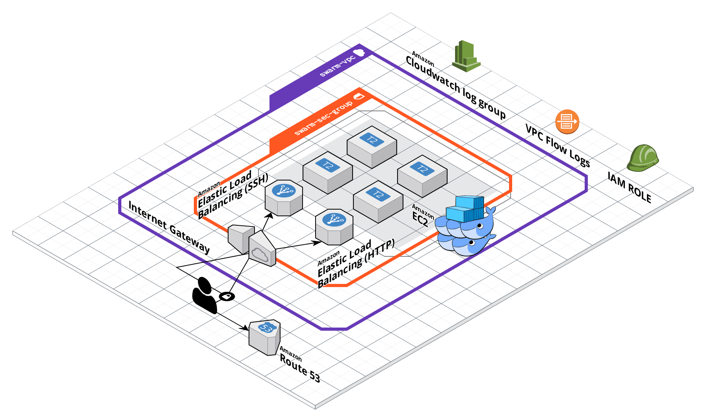

# AWS Docker Swarm Cluster Setup Script

This bash script provisions a fixed size docker swarm cluster using [EC2](https://aws.amazon.com/ec2) in [AWS](https://aws.amazon.com/).

It uses [bash](https://en.wikibooks.org/wiki/Bash_Shell_Scripting) scripts, [docker-machine](https://docs.docker.com/machine/) utility, [AWS CLI](https://aws.amazon.com/documentation/cli/), [JQ](https://stedolan.github.io/jq/manual/) (json CLI processing utility) and [Ansible](https://docs.ansible.com/ansible/latest/index.html) (to init the swarm cluster inside the vm's)

## Requirements

* bash 3.2
* python 2.7
* awk

## Quick Start

* Create API keys access in IAM with permissive policy
* Create file called `password.properties` in project's root dir and supply with `AWS_KEY_ID` and `AWS_SECRET_KEY` variables
* Create file called `aws-variables.properties` in project's root dir use reference values from `template/aws-variables.properties` according to your project
* Run `create-ec2-swarm-cluster.sh`
* Seat back and relax ☕ 

## Infrastructure Architecture

## TODO

* Use terraform
* Create an autoscaling group for workers

## Author

Rogério Castelo Branco Peixoto (rcbpeixoto@gmail.com)